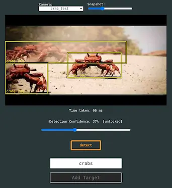

# Text-Based Object Detection Server

Provides a server which allows for performing object detection based on text prompts. Runs on snapshot data from the [DBServer](https://github.com/pacefactory/scv2_dbserver).

<p align="center">
  
</p>

Currently uses [Grounding DINO](https://github.com/IDEA-Research/GroundingDINO), though other models exist and may be worth incorporating in the future (see [NanoOwl](https://github.com/NVIDIA-AI-IOT/nanoowl) and [YOLO-World](https://github.com/AILab-CVC/YOLO-World) for example).


## Running with docker

To run the system using docker, first build the image using:
```bash
bash build/docker/build_image.sh
```
The build script will ask whether you want to use the CPU or GPU build. This choice results in different images (you can have both on your system simultaneously without conflict), but the GPU build is much larger (~4GB for the CPU build, ~10GB for the GPU build!), so it's best to only build the GPU image if you have a system that supports it!

The image(s) can then be run using:
```bash
bash build/docker/run_container.sh
```
Again you'll be asked to choose between CPU and GPU versions when running this script. If you've built both versions, you can quickly swap between them using this script. However, you can't run both simultaneously, since they both map to the same container name and port. If you do want to test GPU vs. CPU performance, there is an option to toggle GPU usage on the server settings page (when running the GPU build).

By default, the container will launch the server on port `3834`.

## Running directly (outside docker)

### Install

To run the server, you first need to install some dependencies. Installation varies depending on the OS and whether you have a machine with a supported GPU. There are separate GPU & CPU install requirements included in the repo, these can be used as follows:

```bash
# Linux & MacOS
python3 -m venv .venv
source .venv/bin/activate
pip install -r requirements/gpu_install.txt
                        .../cpu_install.txt

# Windows
python -m venv .venv
.venv\Scripts\activate.bat
pip install -r requirements/gpu_install.txt
                        .../cpu_install.txt
```

**Note**: With the Windows install as-is, you may get an error about a `missing c10.dll` dependency. The error message also provides a link to a [random .exe installer](https://aka.ms/vs/16/release/vc_redist.x64.exe), which seems to fix the problem.

Windows & MacOS installs are not fully tested, so if you run into errors with the requirements, please see the official [pytorch installer instructions](https://pytorch.org/get-started/locally/).


### Model files

For the system to work, there must be at least one model file (i.e. weights) on the system. For Grounding-DINO, there are currently (as of Apr 2024) two models available, a [base version](https://github.com/IDEA-Research/GroundingDINO/releases/tag/v0.1.0-alpha2) and a [tiny version](https://github.com/IDEA-Research/GroundingDINO/releases/tag/v0.1.0-alpha). Anecdotally these seem to have different strengths/weaknesses, so downloading both is recommended. This can be done manually by downloading the files and placing them in the `storage/models/gdino` folder, or automatically by running the `download_models.sh` script.

Note that model downloads are only neccesary when running the server locally! The docker build includes these files automatically.

### Launching the server

The server can be launched in a development-friendly mode by directly running the python server script:
```bash
# Run server in development mode (uses default settings + auto-reloads)
python run_todserver.py
```

For more direct control, you can use the `uvicorn` command:
```bash
# Run server with custom configs
uvicorn run_todserver:asgi_app --host 0.0.0.0 --port 3834 # --log-level debug --reload
```

### Development extras

When working on this project, it's handy to have the entire library accessible from anywhere in the project folder system, for example to run in-script demos for testing/experimentation. To use this, simply activate the virtual environment for the project, and then at the project root path run the following command:
```bash
pip install -e .
```

This will create an extra folder in the project ('something-something-egg-info') which can be ignored, but otherwise should allow code such as `from local.lib....` to work inside of files that are inside the local folder itself, without crashing. This is only for convenience during development and isn't required for deployments.


## Usage

The server is conceptually very simple. It takes a text prompt (e.g. 'person') along with a camera + specfic snapshot and then returns detections within the snapshot matching parts of the text prompt.

The main functionality comes from a single route: `/v0/detect`, which requires a POST request with a body of the form:

#### Example POST Body
```json
{
    "camera_select": "camera_name",
    "snapshot_ems": 123456789123,
    "text_prompts_list": ["person", "forklift", "pizza", "aliens"],
    "box_confidence": 0.25,  # optional
    "text_confidence": 1     # optional
}
```

From this request, the server will return results in the form:
#### Example detection response
```json
{
    "text_prompt": "person. forklift. pizza. alien",
    "boxes_xywh_norm": [
        [0.302, 0.462, 0.038, 0.054],
        [0.146, 0.625, 0.139, 0.131]
    ],
    "labels": ["person","alien"],
    "scores": [0.281, 0.257],
    "time_taken_ms": 54
}
```
**Note:** Bounding boxes use x-center, y-center, width, height (not top-left xy!)

More detailed information is available on the server documentation page, accessible from the `/redoc` or `/docs` urls, or from the 'info' link on the server home page.

## TODOs
- Add thread lock around model usage
- Remove huggingface dependency (i.e. include BERT text-encoder directly in repo)
